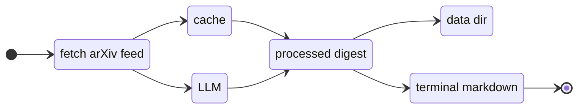

<div align="center">
 <div>
  
 </div>
 <div>
  
 </div>
 <p>
  <a href="https://pypi.org/project/tldrxiv/"></a>
  <a href="https://pypi.org/project/tldrxiv/"></a>
  <a href="https://github.com/PanosEconomou/tldrxiv/blob/main/LICENCE"></a>
  <a href="https://github.com/PanosEconomou/tldrxiv/blob/main/pyproject.toml"></a>
 </p>
</div>

> Reading 30-60 abstracts a day can be tiring! So why not have your computer work for it while you're sipping your morning coffee?

**tldrXiv** is a *free* terminal utility that fetches today's [arXiv](https://arxiv.org/) feeds and provides you with a summary related to **your research interests** while highlighting interesting articles. Here it is!

 <div align="center">
  
</div>

> [!IMPORTANT]
> This tool is not meant as a replacement for reading the arXiv! Read more [here](#limitations).

## Install
```sh
pipx install tldrxiv
```
`pipx` is for CLI tools and will build it in its own environment, but standard `pip install tldrxiv` works too.

<details><summary>From Source</summary>
 
 ```sh
 git clone https://github.com/PanosEconomou/tldrxiv
 cd tldrxiv
 pipx install .
 ```

</details>

it requires `python >= 3.11` but **it has no other dependencies.**

## Quickstart
```sh
export TLDRXIV_LLM_KEY="your-key"   # from aistudio.google.com/apikey (it's free!)
tldrxiv config                      # Tell it your research and (if you want) LLM API Key
tldrxiv                             # That's it!
```
That's it! The first run fetches today's arxiv feed and queries the LLM for a digest. Subsequent runs just load it from cache unless told otherwise.

## Usage
```sh
tldrxiv                    # today's digest
tldrxiv yesterday          # yesterday's, from your archive
tldrxiv 2026-07-14         # a specific day
tldrxiv -3                 # three days ago
tldrxiv yyy                # three days ago
tldrxiv --force            # regenerate today from a fresh feed
tldrxiv config             # open the config file in $EDITOR
```

Any configuration variable can be overriden by an argument. For example:
```sh
tldrxiv -F hep-th math-ph   # overrides the arXiv feeds specified in the config
```
Run `tldrxiv --help` for the complete list of options.

## How it works


The metadata (i.e. abstracts and titles) of today's arXiv announcement's are requested via ATOM and stored in `$XDG_CACHE_HOME/tldrxiv`. Then they are filtered according to the preferences set in the config file, and a single query is formed which is then submitted to the LLM (in this case the free tier of Gemini 3.6 flash). The response is then parsed, stored in `$XDG_DATA_HOME/tldrxiv`, and displayed. 

> [!NOTE]
> The individual article URLs and arXiv identifiers are removed before sending to the LLM, and are reintroduced once the response is received to make sure that the ai doesn't make them up (still always check them). The LLM only has access to titles and abstracts.  

## Configuration
The config file lives in `$XDG_CONFIG_HOME/tldrxiv/config.toml` (usually `~/.config/tldrxiv/config.toml`). You can also open with `tldrxiv config`.

> [!TIP]
> Leave `api_key = ""` in the file and `export TLDRXIV_LLM_KEY` with your API Key instead. That way your config file has no secret in it and is safe to accidentally commit without someone stealing it.

<details> <summary><b>Default config and Reference</b></summary>

Here is the default config.toml file. When typing `tldrxiv config` when a config doesn't exist, it is automatically populated with the file below.
 
 ```toml
# ----------------------------------------------------- #
#  ┓ ┓  ┏┓┏┓•                                           #
# ╋┃┏┫┏┓ ┃┃ ┓┓┏                                         #
# ┗┗┗┻┛ ┗┛┗┛┗┗┛                                         #
#                                                       # 
# Default Configuration File                            #
#                                                       # 
# I commented out a bunch of the options because I      # 
# often have terrible terminology. Hope this works! :>  # 
#                                                       # 
# Location: $XDG_CONFIG_HOME/tldrxiv/config.toml or     #
#           .config/tldrxiv/config.toml                 #
#                                                       # 
# Config Version 0.1.0                                  # 
# ----------------------------------------------------- #

# ----------------------------------------------------- #
# Enter your research interests to tailor the summary   #
# to you                                                #
# ----------------------------------------------------- #

[research]
work = """
This is the default description of your work. A couple
of sentences should suffice. Please replace this.
"""
interests = """
A small paragraph where you describe your research
interests perhaps beyond your current active projects.
It is supposed to be a more general interest than what
is directly relevant to you.
"""

# ----------------------------------------------------- #
# Some settings to specify what arxiv feeds you want    #
# to follow etc.                                        #
# ----------------------------------------------------- #

[arxiv]
# If you only want one feed please till keep it as a list
feeds = [ "hep-th", "math-ph", "cond-mat.str-el" ]

# What type of submissions to look at?
# Do you really want to look at replacement submissions?
types = [ "new", "cross" ]

# The maximum amount of time to wait for arXiv to send 
# you the feeds
timeout = 60 # s

# ----------------------------------------------------- #
# Set up the LLM you want to use to provide you with    #
# the daily arXiv digests. The default is Gemini.       #
# ----------------------------------------------------- #

[llm]
# Leave blank if you want to load it by setting it as the 
# $TLDRXIV_LLM_KEY environment variable. If you want to
# use your own simply write it in quotes
# (e.g "$GEMINI_API_KEY")
#
# Alternatively you can paste your key directly in 
# quotes. But then don't put it anywhere online!
#
# For Gemini you can get a key for the for free tier 
# from: https://aistudio.google.com/apikey
api_key = ""

# The temperature of the LLM that generates the digest.
# Honestly I don't really understand how it affects
# things, but testing showed 0.5 - 0.8 is a good range.
temperature = 0.7

# The actual link to request stuff from the LLM
# This one requests from gemini-3.6-flash, but you can
# Find more links in 
url = "https://generativelanguage.googleapis.com/v1beta/models/gemini-3.6-flash:generateContent"

# ----------------------------------------------------- #
# Storage settings. tldrXiv stores some files in your   #
# computer. Control how many here. By default they are  #
# stored in $XDG_DATA_HOME/tldrxiv and                  #
# $XDG_CACHE_HOME/tldrxiv                               #
# ----------------------------------------------------- #

[storage]
# Each day the arxiv feed is downloaded in cahce in order
# to process it. This is the max number of days before
# the feeds get deleted.
daily_arxiv = 5

# The full response from the LLM is stored as a json file
# in $XDG_DATA_HOME/tldrxiv. This is the max number of
# days before responses get deleted.
daily_digest = 60
 ```
 
</details>

## Limitations

Here are some things worth knowing.
- **`tldrxiv` can only see today's scientific papers, and only abstracts.** I wouldn't be able to run in the free tier if all the references and body of the preprints was fed to gemini. More importantly it **only uses arXiv RSS feeds** which strictly contain metadata under a Public Domain declaration and can be redistributed without attribution while the actual content of the preprints is untouched from the eyes of big tech. I *do not* have plans to extend this tool to use any preprint content to produce a digest.
- **Your work and research paragraphs are fed to Gemini.** Be careful what you disclose in the work and research paragraphs. At the free tier Gemini is using the data to train the model, so don't write stuff that you wouldn't want it to be trained with.
- **Past days can't be generated.** Arxiv RSS feeds only exist for today. This means that if you want to process a digest from a different day you should've already downloaded the RSS feed for that day.
- **It runs on a free API tier.** Expect some `503: Resource is Busy` errors when using this on occasion.
- **FTLOG please don't use this as a substitute for actually reading the arXiv.** I made this only because when I have to read 50 abstracts in the morning before my coffee kicks in I am usually half asleep by the 10th. This tool is meant to highlight what to look out for while browsing, not to substitute the reading.

## Contributing

Please help.

## Credits

A lot of open source stuff was used in this so here are some credits!
 - Thank you to [arXiv](https://arxiv.org/) for use of its open access interoperability. This project is by no means affiliated with arXiv. I am just a fan!
 - [Python Packaging Guide](https://packaging.python.org/en/latest/tutorials/packaging-projects/)
 - [The Hitchiker's Guide to Python/Packaging](https://docs.python-guide.org/writing/structure/)
 - [Regex Patterns in Python](https://docs.python.org/3/howto/regex.html)
 - [Reading TOML in Python](https://realpython.com/python-toml/)
 - [Argument Parsing](https://realpython.com/command-line-interfaces-python-argparse/)
 - [Gemini API and its Keys](https://ai.google.dev/gemini-api/docs/api-key)
 - [Nix Packaging python files](https://nixos.org/manual/nixpkgs/stable/#chap-quick-start)
 - [The arxiv colors I took from Mathew's cool project!](https://github.com/mathewphilipc/classic-arxiv-red)
 - [The logo is an ascii font](https://patorjk.com/software/taag/#p=display&f=Tmplr&t=tldrXiv&x=none)

---

<div align="center"> <sub>Thanks for using tldrXiv. Long live the arXiv! :&gt;</sub> </div>
