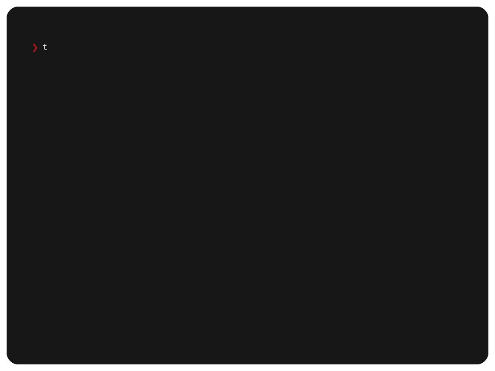

 

  
 

 

  
 

 

  
  
  
  
 

> Reading 30-60 abstracts a day can be tiring! So why not have your computer work for it while you're sipping your morning coffee?

**tldrXiv** is a terminal utility that fetches today's [arXiv](https://arxiv.org/) feeds and provides you with a summary related to **your research interests**, drawing connections, and highlighting interesting articles. Here it is!

 

  

## Credits

A lot of open source guides were used in this so here are some credits!
 - [Python Packaging Guide](https://packaging.python.org/en/latest/tutorials/packaging-projects/)
 - [The Hitchiker's Guide to Python/Packaging](https://docs.python-guide.org/writing/structure/)
 - [Regex Patterns in Python](https://docs.python.org/3/howto/regex.html)
 - [Reading TOML in Python](https://realpython.com/python-toml/)
 - [Argument Parsing](https://realpython.com/command-line-interfaces-python-argparse/)
 - [Gemini API and its Keys](https://ai.google.dev/gemini-api/docs/api-key)
 - [The logo is an ascii font](https://patorjk.com/software/taag/#p=display&f=Tmplr&t=tldrXiv&x=none)

